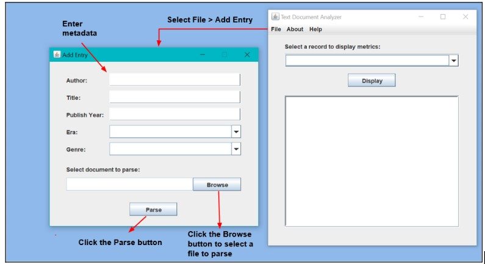

# Text-Document-Analyzer

## CMSC495 Group Project

The Text Document Analyzer is a stand alone application for parsing UTF-8 text documents and extracting statistical and mathematical metrics from the written work. Extracted data is stored in an integrated database so that it may be recalled at the user's convenience. Data records can be added to the database, deleted from the database, or displayed using the GUI's menus and controls.

### Requirements

1. Java Run-time Environment (JRE) version 8 Update 341: https://www.java.com/download/

2. Java Developer Kit (JDK) 19: https://www.oracle.com/java/technologies/downloads/
